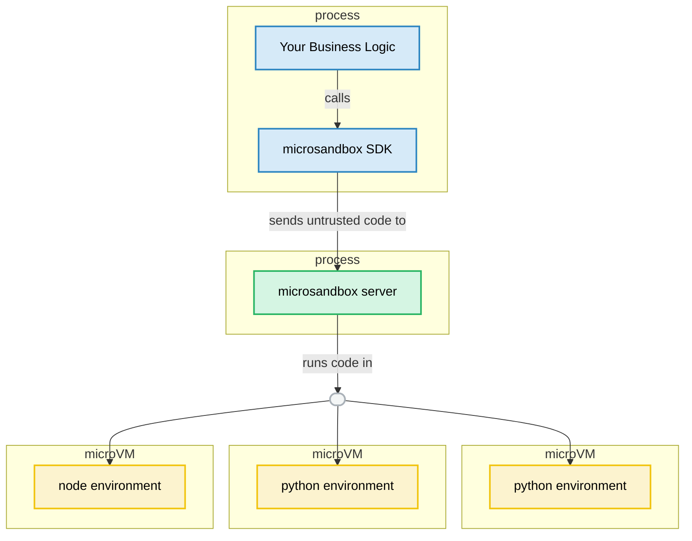

# Developing Microsandbox

This guide is intended for developers who want to contribute to the microsandbox project. It covers the development environment setup, build process, testing, and release procedures.

## Architecture




## 🔧 Development Environment Setup

### Prerequisites

- **Operating System**: macOS or Linux
  - macOS: Requires Apple Silicon (M1/M2/M3/M4)
  - Linux: KVM virtualization must be enabled
- **Rust Toolchain**: The project uses the Rust toolchain defined in `rust-toolchain.toml`

### Setup Steps

1. **Clone the repository**:

   ```bash
   git clone https://github.com/microsandbox/microsandbox.git
   cd microsandbox
   ```

2. **Build and install the project**:

   ```bash
   make install
   ```

   This single command will build all components and install the binaries to `~/.local/bin` and libraries to `~/.local/lib`. Make sure these directories are in your PATH and library search paths.

## 🏗️ Building

The primary build tool for microsandbox is `make`. The main build targets are:

- `make install`: Build and install all components in one step (recommended)
- `make build`: Build all components without installing
- `make clean`: Clean build artifacts
- `make build_libkrun`: Build only the libkrun dependency

To see all available make targets and their descriptions:

```bash
make help
```

## 🔍 Code Quality

### Pre-commit Hooks

We use [pre-commit](https://pre-commit.com/) to automatically run code quality checks before each commit. This ensures consistent code formatting and catches common issues early.

Install pre-commit:

```bash
# Using pip
pip install pre-commit

# Using Homebrew (macOS)
brew install pre-commit
```

After cloning the repository, install the git hooks:

```bash
# Install pre-commit hooks
pre-commit install
```

## 🧪 Testing

### Running Tests

To run all tests in the project:

```bash
cargo test --all
```

For more focused testing:

```bash
# Run tests for a specific crate
cargo test -p microsandbox-core

# Run tests with specific features
cargo test --all --features cli

# Run a specific test
cargo test test_name
```

### Adding Tests

When adding new features or fixing bugs, please include appropriate tests:

- **Unit tests**: Test individual functions and components
- **Integration tests**: Test interactions between different parts of the system
- **Documentation tests**: Demonstrate API usage through examples

## 📦 Releasing

### Creating a Release Package

When preparing for a GitHub release, use the packaging script to create a distributable tarball:

```bash
./scripts/package_microsandbox.sh <version>
```

For example:

```bash
./scripts/package_microsandbox.sh 0.1.0
```

This script:

1. Builds microsandbox and its dependencies
2. Creates a versioned directory with OS and architecture info
3. Copies all necessary binaries and libraries
4. Creates a tarball and its SHA256 checksum

The resulting files will be located in the `build/` directory:

- `microsandbox-<version>-<os>-<arch>.tar.gz`
- `microsandbox-<version>-<os>-<arch>.tar.gz.sha256`

### Release Process

1. Update version numbers in relevant files
2. Run the packaging script on each supported platform
3. Create a GitHub release
4. Upload the generated tarball and checksum files
5. Update the release notes with the changes since the last release

## 📚 Additional Resources

- [CONTRIBUTING.md](./CONTRIBUTING.md): Guidelines for contributing to the project
- [CODE_OF_CONDUCT.md](./CODE_OF_CONDUCT.md): Community code of conduct
- [SECURITY.md](./SECURITY.md): Security policies and reporting vulnerabilities
